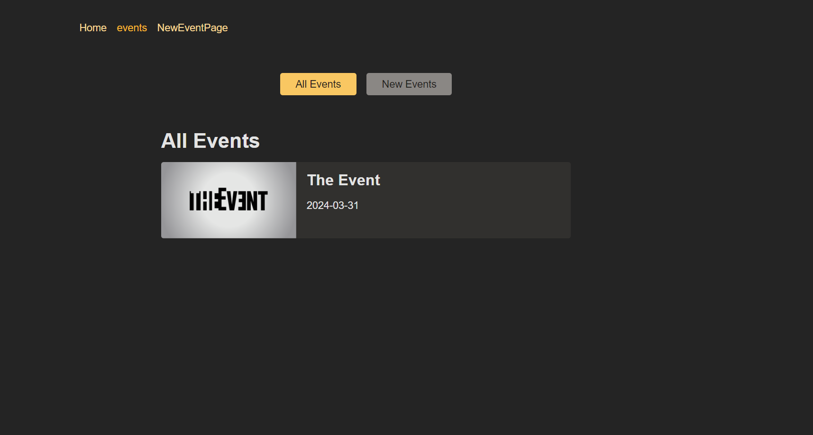
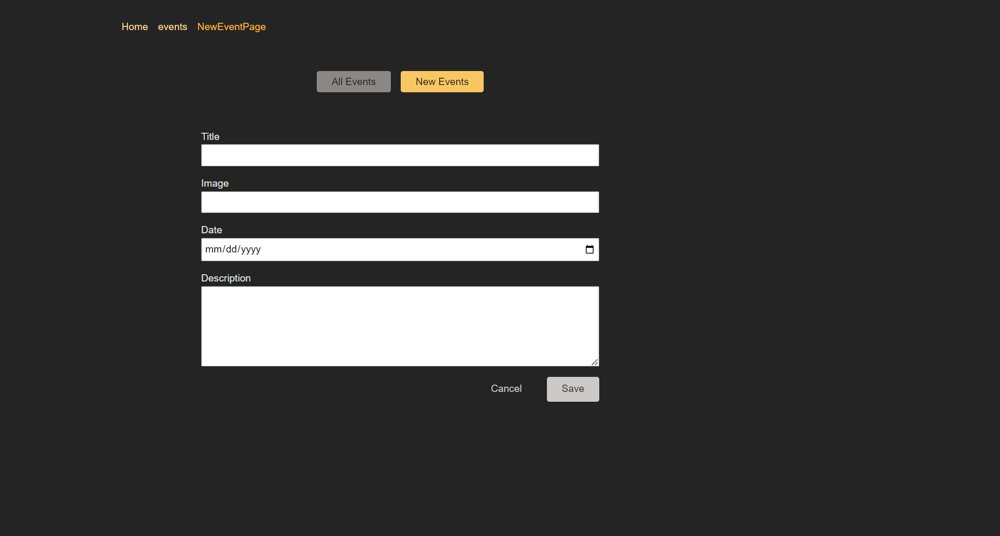
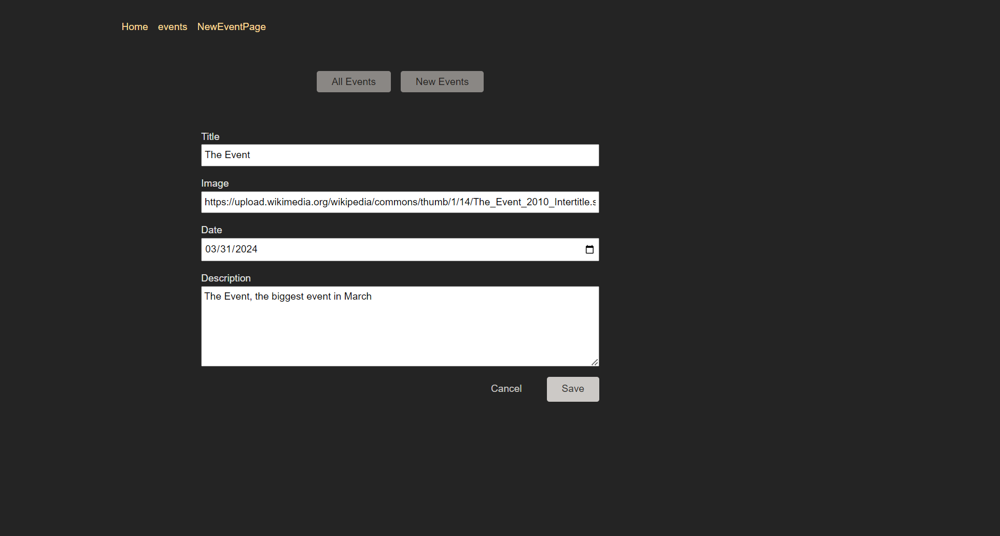
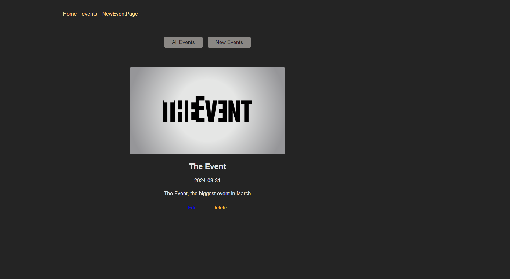

# React Router Event App

## Description
This is a React application for managing events. Users can add new events, edit existing events, and delete events. The app utilizes React Router for dynamic client-side routing.

## Screenshots

## Features
- **Dynamic Routing:** Utilizes React Router for dynamic client-side routing.
- **Component-Based:** Built with reusable React components for easy maintenance and scalability.
- **Responsive Design:** Responsive layout using CSS Flexbox/Grid and media queries.
- **Loader:** Provides visual feedback to users during data loading.
- **Actions:** Allows users to add, edit, and delete events.
- **Error Handling:** Provides error messages and handles errors gracefully.

## Installation
### Frontend
1. Clone the repository: `git clone <repository_url>`
2. Navigate to the frontend directory: `cd react-router-event-app/frontend`
3. Install dependencies: `npm install`
4. Start the development server: `npm start`
5. Open your browser and navigate to `http://localhost:3000`

### Backend
1. Navigate to the backend directory: `cd react-router-event-app/backend`
2. Install dependencies: `npm install`
3. Start the backend server: `npm start`

## Usage
1. Start the development server: `npm start`
2. Open your browser and navigate to `http://localhost:3000`

## Contributing
Contributions are welcome! If you find any bugs or have suggestions for improvement, feel free to open an issue or submit a pull request.
